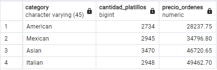
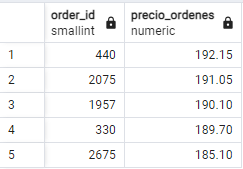

# Diplomado Analítica Ciencia Datos-SQL
Repositorio para almacen el Caso Práctico del Módulo de SQL

## Contexto
El restaurante "Sabores del Mundo", es conocido por su auténtica cocina y su ambiente acogedor.

Este restaurante lanzó un nuevo menú a principios de año y ha estado recopilando información detallada sobre las transacciones de los clientes para identificar áreas de oportunidad y aprovechar al máximo sus datos para optimizar las ventas.

## Objetivo
Identificar cuáles son los productos del menú que han tenido más éxito y cuales son los que menos han gustado a los clientes.

Considerando:

## Resultados
De un total de 32 productos con origenes Americano, Italiano, Asiático y Mexicano, todos presentaron ventas. 

Entre las fechas "2023-01-01" y "2023-03-31" se realizarón 5370 pedidos únicos, teniendo como máximo hasta 14 platillos vendidos en un solo pedido. En prómedio, los costos de los platicos es 13.29. Existiron 137 ordenes que no lograron concretar consumo. 

Los pedidos con order_id 440 y 2657 estan ambos en el top de cantidad de platillos y montos mayores.

 

## Conclusiones

° El producto con mayor valor acumulador fue "Korean Beef Bowl" con 588 platillos y monto de 10,554.60. Por otro lado, el producto con menor valor acumulado fue "Chicken Tacos" con 123 platillos y monto de 1469.85.

° La categoría que más dinero vendio fue: "Italian" con 2948 platillos y un monto de 49,462.70. Así como la que vendio menos fue la "American" con 2734 platillos y un monto de 28,237.75.

° El día con mayor cantidad de platillos vendidos fue: "2023-03-31" con 159.